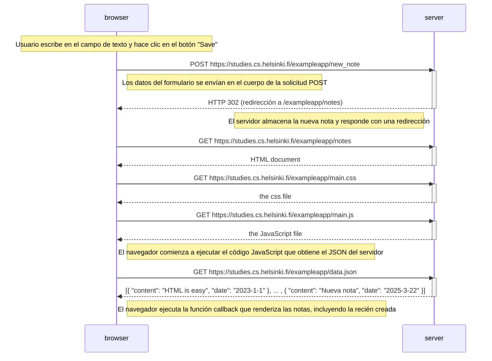

```mermaid
sequenceDiagram
    participant browser
    participant server
    
    Note over browser: Usuario escribe en el campo de texto y hace clic en el botón "Save"
    
    browser->>server: POST https://studies.cs.helsinki.fi/exampleapp/new_note
    activate server
    Note right of browser: Los datos del formulario se envían en el cuerpo de la solicitud POST
    server-->>browser: HTTP 302 (redirección a /exampleapp/notes)
    deactivate server
    Note left of server: El servidor almacena la nueva nota y responde con una redirección
    
    browser->>server: GET https://studies.cs.helsinki.fi/exampleapp/notes
    activate server
    server-->>browser: HTML document
    deactivate server
    
    browser->>server: GET https://studies.cs.helsinki.fi/exampleapp/main.css
    activate server
    server-->>browser: the css file
    deactivate server
    
    browser->>server: GET https://studies.cs.helsinki.fi/exampleapp/main.js
    activate server
    server-->>browser: the JavaScript file
    deactivate server
    
    Note right of browser: El navegador comienza a ejecutar el código JavaScript que obtiene el JSON del servidor
    
    browser->>server: GET https://studies.cs.helsinki.fi/exampleapp/data.json
    activate server
    server-->>browser: [{ "content": "HTML is easy", "date": "2023-1-1" }, ... , { "content": "Nueva nota", "date": "2025-3-22" }]
    deactivate server
    
    Note right of browser: El navegador ejecuta la función callback que renderiza las notas, incluyendo la recién creada
```
