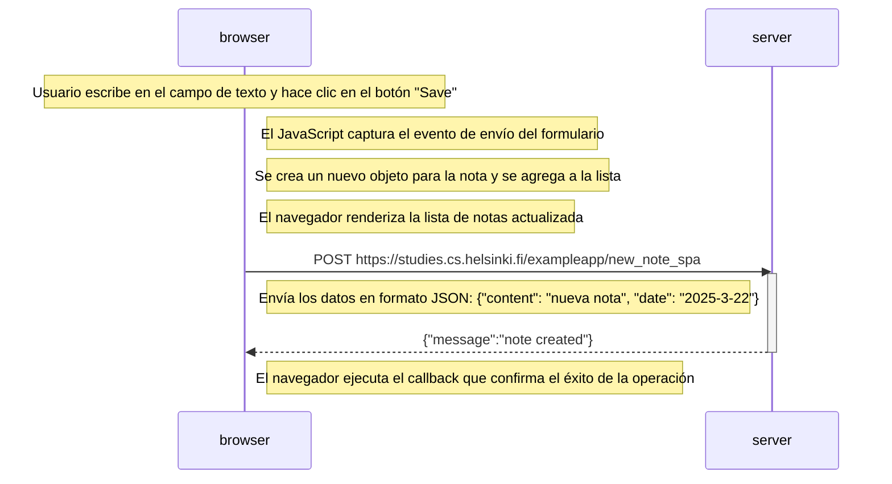

```mermaid
sequenceDiagram
    participant browser
    participant server
    
    Note over browser: Usuario escribe en el campo de texto y hace clic en el botón "Save"
    
    Note right of browser: El JavaScript captura el evento de envío del formulario
    Note right of browser: Se crea un nuevo objeto para la nota y se agrega a la lista
    Note right of browser: El navegador renderiza la lista de notas actualizada
    
    browser->>server: POST https://studies.cs.helsinki.fi/exampleapp/new_note_spa
    activate server
    Note right of browser: Envía los datos en formato JSON: {"content": "nueva nota", "date": "2025-3-22"}
    server-->>browser: {"message":"note created"}
    deactivate server
    
    Note right of browser: El navegador ejecuta el callback que confirma el éxito de la operación
```
